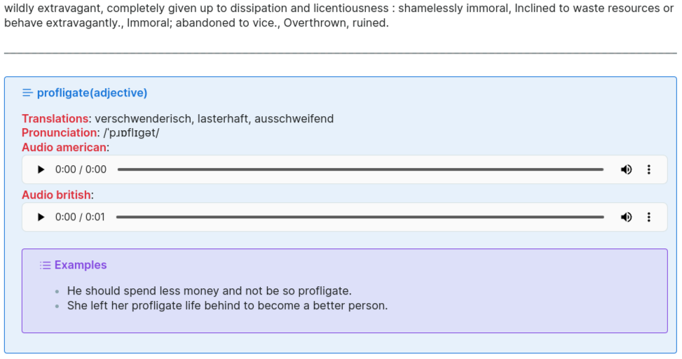

# 📘 English Vocabulary Flashcard Generator

A Python script that generates English vocabulary flashcards in Markdown format for use in **Obsidian**, tailored for the **Spaced Repetition** plugin.

## ✨ Features

- **Multisource Word Enrichment**:
  - Translations, examples and forms from [Linguee.com](https://www.linguee.com) using an [unofficial API wrapper](https://linguee-api.fly.dev/docs)
  - Definitions and examples from:
    - [Merriam-Webster Collegiate Dictionary](https://www.merriam-webster.com/)
    - [dictionaryapi.dev](https://dictionaryapi.dev/)
- **Audio Support**:
  - Embeds playable **British** and **American English** audio (if available).
- **Markdown Output**:
  - Generates Obsidian-compatible Markdown flashcards.
  - Format compatible with the [Spaced Repetition](https://github.com/st3v3nmw/obsidian-spaced-repetition) plugin for [Obsidian](https://www.obdisian.md)
- **Automated Processing**:
  - Reads words from `wordlist.md`, appends flashcards to `vocabulary.md`, and removes processed words.
  - Retrieves multiple examples, definitions, and translations per word.
- **Server Support**:
  - Optionally starts a local `linguee-api` server via `uvicorn` for faster/controlled access.

## 📦 Installation

### Requirements

- Python 3.9+
- `requests`
- `python-dotenv`
- `linguee-api` (for local Linguee API server)
- Environment file with Merriam-Webster API key(`.env`):
  >[!TIP] Don't have an API key?
  > It's optional — the script will still work using other sources.
  > You can register for free at Merriam-Webster API and get a key for the Collegiate Dictionary if you want to enrich your flashcards further."`

  - `.env`: `API_KEY="put_your_merriam_webster_collegiate_api_key_here`
Install dependencies:

```bash
pip install -r requirements.txt
```

## 🚀 Usage

1. Add words (one per line) to wordlist.md.

2. Run the script:

```bash
python vocabulary.py
```

-> Output will be appended to vocabulary.md in flashcard format.

## 📁 File Structure

wordlist.md – Input file containing English words (one per line).

vocabulary.md – Output file where Markdown-formatted flashcards are appended.

.env – File storing your Merriam-Webster API key.

## 🔊 Flashcard Format (Example)


